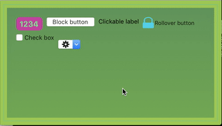

## Ditko

*Ditko* is an iOS/macOS/tvOS/watchOS framework that extends the `AppKit`, `UIKit`, and `WatchKit` frameworks. It provides a variety of classes, categories, functions and macros that simplify repetitive tasks on the various platforms. It relies on the [Stanley](https://github.com/Kosoku/Stanley) framework.

Demo icons by [Glyphish](http://www.glyphish.com/).

### Installation

You can install *Ditko* using [cocoapods](https://cocoapods.org/), [Carthage](https://github.com/Carthage/Carthage), or as a framework. When installing as a framework, ensure you also link to [Stanley](https://github.com/Kosoku/Stanley) and [Loki](https://github.com/Kosoku/Loki) as *Ditko* relies on them.

### Dependencies

Third party:

- [Stanley](https://github.com/Kosoku/Stanley)
- [Loki](https://github.com/Kosoku/Loki)